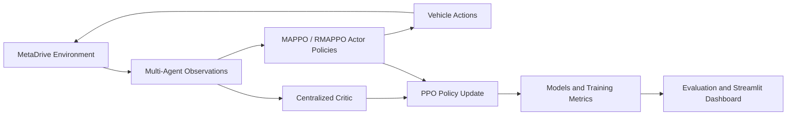

<div align="center">

# Autonomous Vehicle MAPPO

### Cooperative multi-agent autonomous driving with MAPPO, RMAPPO, and MetaDrive

[](https://www.python.org/)
[](https://pytorch.org/)
[](https://github.com/metadriverse/metadrive)
[](MAPPO_AVs/LICENSE)

A research-oriented framework for training, evaluating, and visualizing cooperative autonomous vehicles in multi-agent traffic environments.

</div>

---

## Overview

This project applies **Multi-Agent Proximal Policy Optimization (MAPPO)** and its recurrent variant, **RMAPPO**, to cooperative autonomous-driving scenarios built with the MetaDrive simulator.

It includes:

- Centralized training with decentralized execution.
- Feed-forward MAPPO and recurrent RMAPPO policies.
- Shared and separated policy runners.
- Multi-agent MetaDrive environments and vectorized wrappers.
- Model evaluation and simulation utilities.
- A Streamlit dashboard for evaluation, training metrics, and live simulation.
- Support for intersection, roundabout, tollgate, bottleneck, parking-lot, and procedural road environments.

## System Workflow



## Repository Structure

```text
AutonomousVehicleMAPPO/
├── main.py                         # Main Streamlit dashboard
├── unified_dash.py                 # Dashboard with local authentication
├── user_support_tab.py             # Support-ticket UI component
├── MAPPO_AVs/
│   ├── requirements.txt            # Core dependency entry point
│   ├── LICENSE
│   └── mappo/
│       ├── algorithms/             # MAPPO/RMAPPO networks and optimization
│       ├── envs/                   # MetaDrive environments and wrappers
│       ├── runner/                 # Shared and separated policy runners
│       ├── train/train.py          # Training and integrated evaluation
│       ├── eval.py                 # MetaDrive environment smoke test
│       ├── evaluate.py             # Checkpoint evaluation utility
│       ├── record_video.py         # Video-recording utility
│       ├── drawgraph/              # Metric-processing scripts
│       ├── config.py               # Training and environment arguments
│       └── requirements.txt
└── .gitignore
```

MetaDrive is installed as a Python dependency; its source repository is not copied into this project.

## Installation

### 1. Clone the repository

```bash
git clone https://github.com/imranashrafai/AutonomousVehicleMAPPO.git
cd AutonomousVehicleMAPPO
```

### 2. Create a virtual environment

```bash
python -m venv .venv
```

Activate it:

```bash
# Windows
.venv\Scripts\activate

# Linux/macOS
source .venv/bin/activate
```

### 3. Install the MAPPO dependencies

```bash
python -m pip install --upgrade pip
pip install -r MAPPO_AVs/requirements.txt
```

### 4. Install dashboard dependencies

```bash
pip install streamlit pandas plotly pillow tensorboard mss opencv-python
```

> A CUDA-enabled PyTorch installation is recommended for training but is not required for basic evaluation or dashboard use.

## Running the Dashboard

From the repository root:

```bash
streamlit run main.py
```

The dashboard provides:

- Trained-model discovery and evaluation.
- MAPPO versus RMAPPO metric visualization.
- Configurable live MetaDrive simulation.
- Screenshot and simulation-output generation.

To run the authentication-enabled version:

```bash
streamlit run unified_dash.py
```

## Training

Move into the MAPPO package:

```bash
cd MAPPO_AVs/mappo
```

### Train MAPPO

```bash
python train/train.py \
  --algorithm_name mappo \
  --env intersection \
  --num_agents 4 \
  --num_env_steps 100000 \
  --experiment_name mappo_baseline
```

### Train RMAPPO

```bash
python train/train.py \
  --algorithm_name rmappo \
  --env intersection \
  --num_agents 4 \
  --num_env_steps 100000 \
  --experiment_name rmappo_baseline
```

Available values for `--env`:

| Environment | Argument |
|---|---|
| Roundabout | `roundabout` |
| Intersection | `intersection` |
| Tollgate | `tollgate` |
| Bottleneck | `bottleneck` |
| Parking lot | `parkinglot` |
| Procedural multi-agent map | `pgma` |

Training outputs are generated under:

```text
MAPPO_AVs/mappo/results/<environment>/<scenario>/<algorithm>/<experiment>/run*/
```

Results, checkpoints, videos, and runtime artifacts are intentionally ignored by Git.

## Evaluation

### Environment smoke test

```bash
cd MAPPO_AVs/mappo
python eval.py --map X --num_agents 4 --seed 42 --steps 500
```

Supported map codes include `X`, `O`, `T`, `S`, `C`, `CXSOT`, and `random`.

### Evaluate a trained checkpoint

```bash
python train/train.py \
  --algorithm_name mappo \
  --env intersection \
  --num_agents 4 \
  --eval \
  --eval_model_dir "path/to/model/directory"
```

## Configuration

Most experiment settings are defined in:

```text
MAPPO_AVs/mappo/config.py
```

Important options include:

- `--algorithm_name`: `mappo` or `rmappo`
- `--num_agents`: number of controllable vehicles
- `--env`: MetaDrive scenario
- `--seed`: experiment seed
- `--num_env_steps`: total training steps
- `--episode_length`: rollout horizon
- `--hidden_size`: actor/critic hidden dimension
- `--lr` and `--critic_lr`: optimizer learning rates
- `--use_eval`: evaluate during training
- `--use_render`: render the training environment

Run the following command to see all available options:

```bash
python MAPPO_AVs/mappo/train/train.py --help
```

## Current Implementation Notes

- Some paths in `main.py`, `unified_dash.py`, and `MAPPO_AVs/mappo/train/train.py` are currently configured for a Windows development environment. Update those path constants for your machine before using checkpoint discovery or output capture.
- `unified_dash.py` uses a local `users.json` file for demonstration authentication. The file is ignored by Git, but the current plaintext-password approach must be replaced with hashing and a database before deployment.
- Trained models and datasets are not included in this source-only repository.

## Security and Repository Hygiene

The `.gitignore` excludes:

- Virtual environments and Python caches.
- Local credentials and environment files.
- MetaDrive source checkouts.
- Training results, checkpoints, TensorBoard events, and WandB runs.
- Generated videos, screenshots, diagrams, and personal images.

Never commit passwords, API keys, private datasets, or user records.

## License

The MAPPO implementation is distributed under the [MIT License](MAPPO_AVs/LICENSE).

## Author

**Imran Ashraf**

- GitHub: [@imranashrafai](https://github.com/imranashrafai)
- Repository: [AutonomousVehicleMAPPO](https://github.com/imranashrafai/AutonomousVehicleMAPPO)
